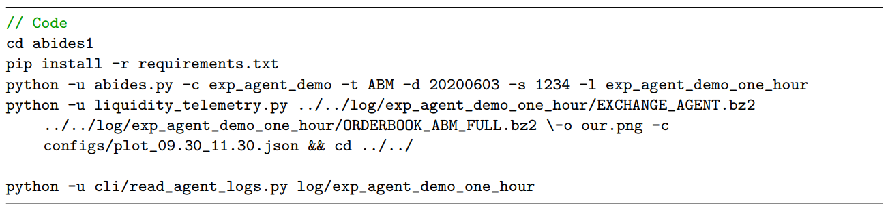

# GAN-for-Synthetic-Agent-in-market-simulation-environments

## Introduction

In our project we have created a financial agent that buys and sells stocks on a simulated market by using Generative Adversarial Network. We have worked on Amazon, Apple, Goggle, Intel and Microsoft level 1 LOBSTER’s data. We consider each data set as on agent, in this case we would have 5 different agents which each line in LOBSTER’s data is one data sample regarding the agent. For example Amazon would be an agent and each line of the order book would be a data sample. Our final goal is to make a new agent based one the previous agents who sell and buy stocks in the market. To test the functionality of the generated agents we used Agent-Based Interactive Discrete Event Simulation environment([ABIDES](https://github.com/abides-sim/abides)).

## Data

We implemented our model by using the [LOBSTER](https://lobsterdata.com/info/DataSamples.php) data-sets which is based on the official NASDAQ Historical, named AMZN,AAPL, GOOG, INTC, MSFT and in this project we have used level one of each dataset. 

## Preprocessing

 * Filtered transactions with type equals to 4 and 5
 * dropped useless columns such as ’orderid’, ’eventtype’ and etc
 * Merging all 5 data-sets
 * shuffled the data
 * Min-max normalization or denormalization
 
After performing Preprocessing step we would have 123985 data with 3 features (Price, Direction and Size)

```
%cd AI4TPG
%cd Code
!python pre_process_ai4trading.py
```

## Generative Adversarial Network

```
%cd AI4TPG
%cd Code
!python gan.py
```

## Abides

ABIDES is an Agent-Based Interactive Discrete Event Simulation environment. ABIDES is designed from the ground up to support AI agent research in market applications. While simulations are certainly available within trading firms for their own internal use, there are no broadly available high-fidelity market simulation environments. ABIDES is designed from the ground up to support AI agent research in market applications. ABIDES enables the simulation of many trading agents interacting with an exchange agent to facilitate transactions.

For our agent we used exp_agent_demo.py Abides configuration. This configuration is a variant of rmsc03.py0 configuration. So we have these following components:
* 1 Exchange Agent
* 100 Value Agents
* 25 Momentum Agents
* 5000 Noise Agents
* 1 POV Market Maker Agent

In our project we have added ‘ExampleExperimentalAgentTemplate’ and ‘ExampleExperimentalAgent’ agents in which ExampleExperimentalAgentTemplate is a simple agent with no effect on the market. It merely sits and receives market data at some subscription frequency. So an Agent wakes up at a fixed frequency, but takes no action and ExampleExperimentalAgent which inherits from the ‘Example Experimental AgentTemplate’. Here you can see the parameters that we defined according to our requirements.
* ”wake-freq” means how often the agent will trade.
* ”order-size” shows size of market order placed.
* ”short-window” as a ”short-term”.
* ”long-window” as a ”long-term”.
* If ”short-term” is greater than ”long-term” then sell ”order-size”.
* If ”short-term” is less than ”long-term” then buy ”order-size”.

After you have installed Abides on your machine you must replace ExampleExperimentalAgent.py and exp_agent_demo.py with the original files.
Finally by executinh the following codes you can start trading with your new agents.
 
 

 
